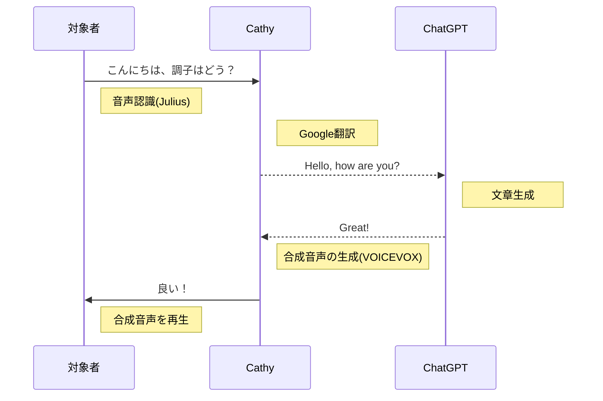
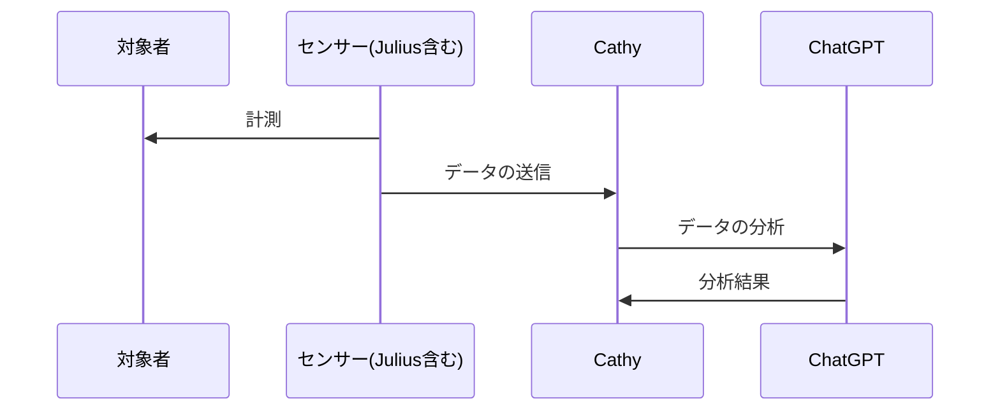

# Cathy

# 概要

ChatGPTとVOICEVOXを活用した対象者の状態記録の自動化・伝達。

このレポジトリは以下のフローを達成するためのレポジトリ。  
Cathyのメインフローはこんな感じ  

Cathyを支える計測の自動化フローはこんな感じ  

使用するライブラリ・ソフトウェア等一覧  
[ffmpeg](https://ffmpeg.org)  
[voicevox_core-0.14.1+cpu-cp38-abi3-win_amd64.whl](https://github.com/VOICEVOX/voicevox_core/releases/download/0.14.1/voicevox_core-0.14.1+cpu-cp38-abi3-win_amd64.whl)  
pip install voicevox_core-0.14.1+cpu-cp38-abi3-win_amd64.whl  
pip install googletrans==4.0.0-rc1  
pip install openai  
pip install openai-whisper  
pip install pyaudio  
pip install wave  

# プログラムのファイル名称について  
先端に「hello」とついているのは機能の動作テストプログラム  
先端に「example」とついているのはPythonやライブラリの文法チェック用のファイル  
## cathyMain.pyについて  
cathyMain.pyがcathyの本体のソースコードで、コミュニケーションの機能はこのファイルに最終的に集約される  
開発の流れとして、「hello」や「example」で機能を一つ一つテストしていき、要件を満たすことができたプログラムをcathyMain.pyに実装される
